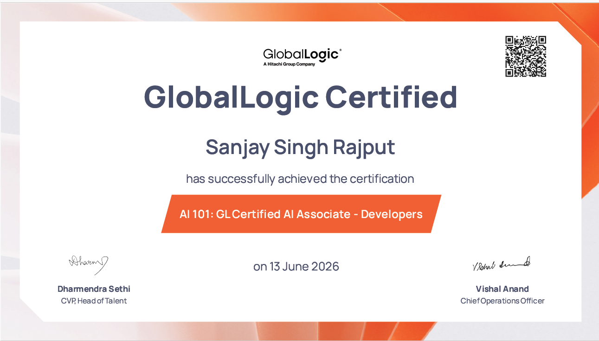

# My Certificates

I have completed the AI 101 – GL Certified AI Associate (Developers) certification.

This learning journey strengthened my understanding of the core concepts shaping today's AI-driven world, including:

🔹 Artificial Intelligence
- Introduction to Artificial Intelligence

🔹 Prompt Engineering
- Introduction to Prompt Engineering for Generative AI
- Top 10 AI Prompting Techniques

🔹 AI in the Software Development Lifecycle (SDLC)
- Understanding how AI is transforming modern development, testing, and delivery practices

🔹 Agentic AI
- Fundamentals of Agentic AI
- Business implications and ethical considerations of autonomous AI systems

🔹 AI Ethics & Governance
- Ethics in the age of Generative AI
- Introduction to AI Governance Frameworks
